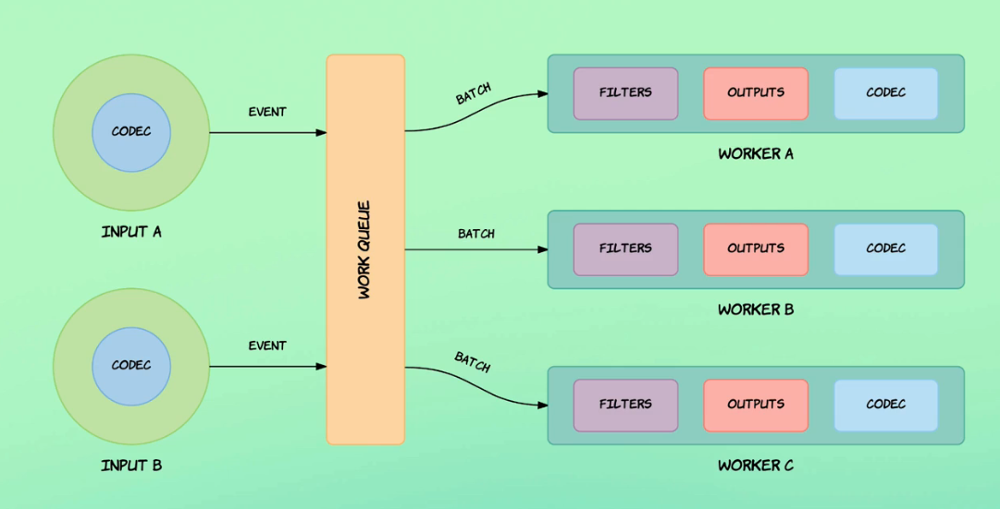
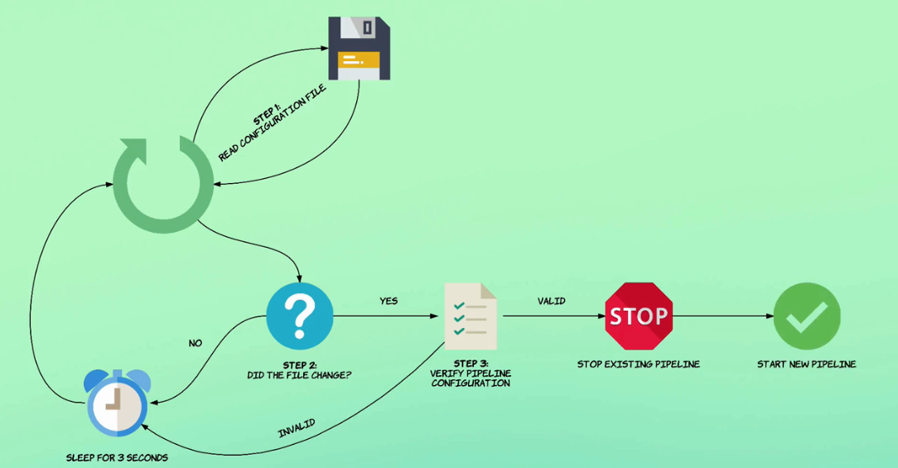
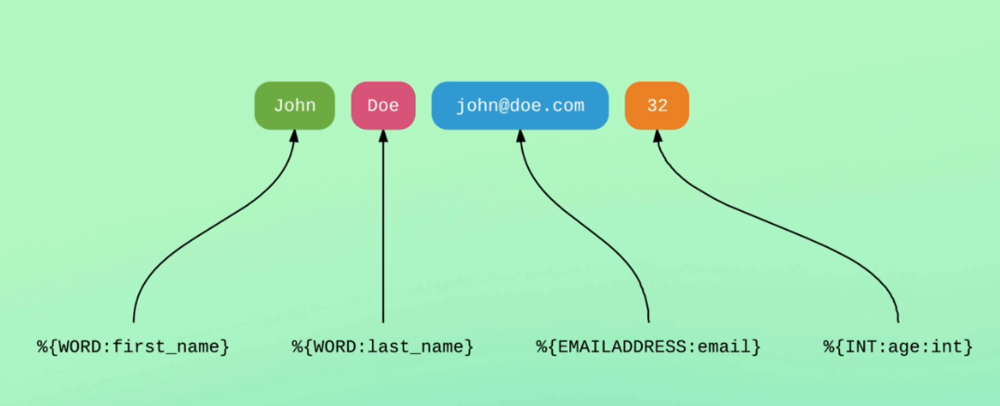

# apache_log_wLogstash

# Event execution model


# File execution model


#Grok pattern




# dependecies 

- JAVA configure with JAVA_HOME
- logstash 7.8.1

# Automatic file input change command

```
bin/logstash -f config/pipelines.conf --config.reload.automatic

```

specific path for pipeline

```
sudo bin/logstash --path.settings /etc/logstash/ --path.data sensor39 -f /home/tigrow/Downloads/logstash-7.8.1/config/pipelines.conf
```

# run multiple pipelines

```
bin/logstash --config.reload.automatic

```


# sinceDb location

```
cd /home/tigrow/Downloads/logstash-7.8.1/data/plugins/inputs/file
ls -al
```

remove sinceDb files to execute files from beginning

```
rm .sincedb_*
```

# GROC patterns

https://github.com/logstash-plugins/logstash-patterns-core/tree/master/patterns
https://www.elastic.co/guide/en/logstash/current/plugins-filters-grok.html


# parsed Http request


```
{
          "ident" => "-",
        "request" => "/files/blogposts/20090519/",
           "host" => "tigrow",
       "clientip" => "5.10.83.21",
      "timestamp" => "20/May/2015:19:05:52 +0000",
           "verb" => "GET",
          "bytes" => "976",
           "path" => "/home/tigrow/Downloads/logstash-7.8.1/event_data/apache_logs.txt",
       "referrer" => "\"-\"",
           "auth" => "-",
    "httpversion" => "1.1",
     "@timestamp" => 2020-08-17T07:00:57.458Z,
          "agent" => "\"Mozilla/5.0 (compatible; AhrefsBot/5.0; +http://ahrefs.com/robot/)\"",
        "message" => "5.10.83.21 - - [20/May/2015:19:05:52 +0000] \"GET /files/blogposts/20090519/ HTTP/1.1\" 200 976 \"-\" \"Mozilla/5.0 (compatible; AhrefsBot/5.0; +http://ahrefs.com/robot/)\"",
       "@version" => "1",
       "response" => "200"
}
```

##TODO

1.complete grok pattern with
    muatate
    access field values
    format date
    event timing
    conditional statements
    geographical data enrichment
    parsing user agent
    remove fields
    handle multiline evets
    parsing stack traces
    @metadata

2.visualization

